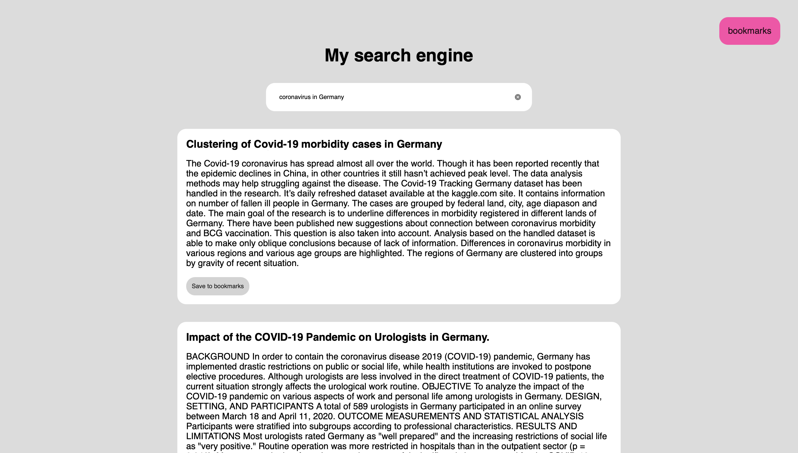
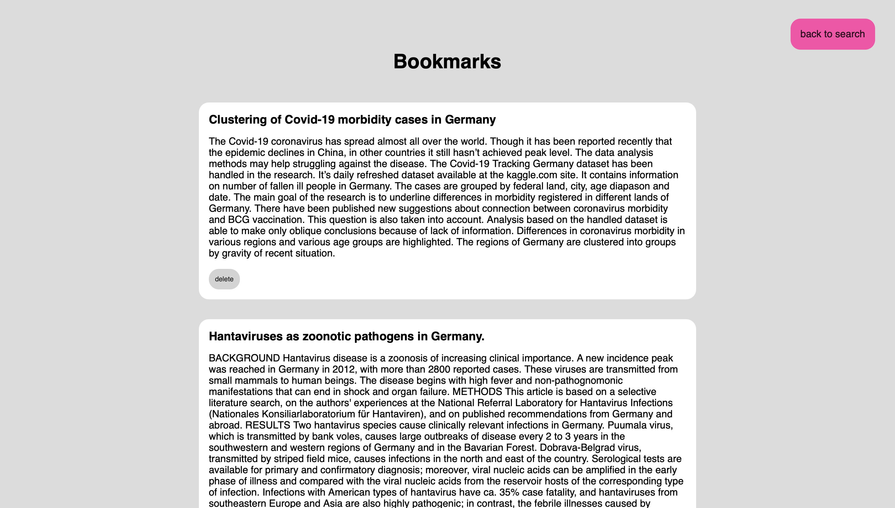
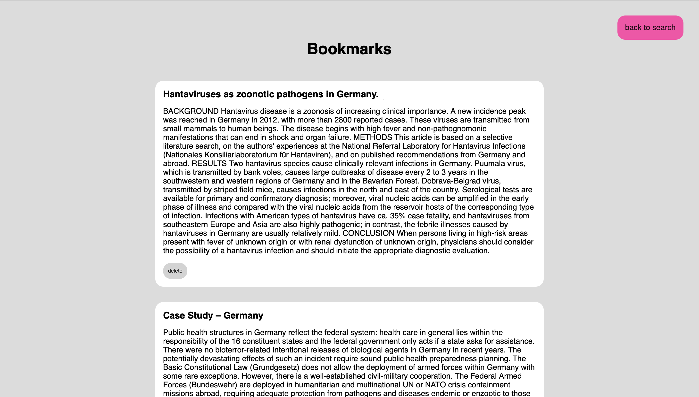

## Семестровый проект 
### Курс "Архитектура компьютерных сетей"
### Поляков Григорий М05-115а

Реализация поискового сервиса. Реализован поиск по запросу по заданному набору документов.
Документы загружаются в базу данных elasticsearch. Поиск производится с помощью алгоритма BM25.

В качестве тестовой базы документов рассматривается датасет TREC-COVID со медицинскими статьями.

С бэкендом по сети взаимодействует react приложение. Реализована главная страничка с поисковой строкой. 
А также возможность добавления документов в закладки. Закладки хранятся в localStorage браузера пользователя.

Примеры:





Запустить приложение можно с помощью docker. Создаются три отдельных контейнера для базы данных, python бэкенд приложения и javascript фронтенд.

Используется docker версии 4.12.0

Для запуска выполнить команды в корне репозитория:

```docker-compose build```
```docker-compose up```

React приложение будет доступно по адресу `http://localhost:3000/`
Запросы к бэкенд приложению можно делать через поисковую строку
Пример:
`http://localhost:5000/search?q=corona`

